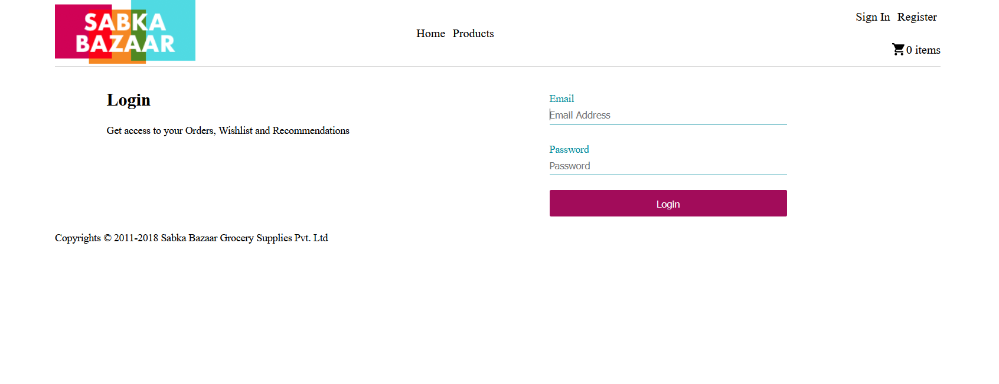
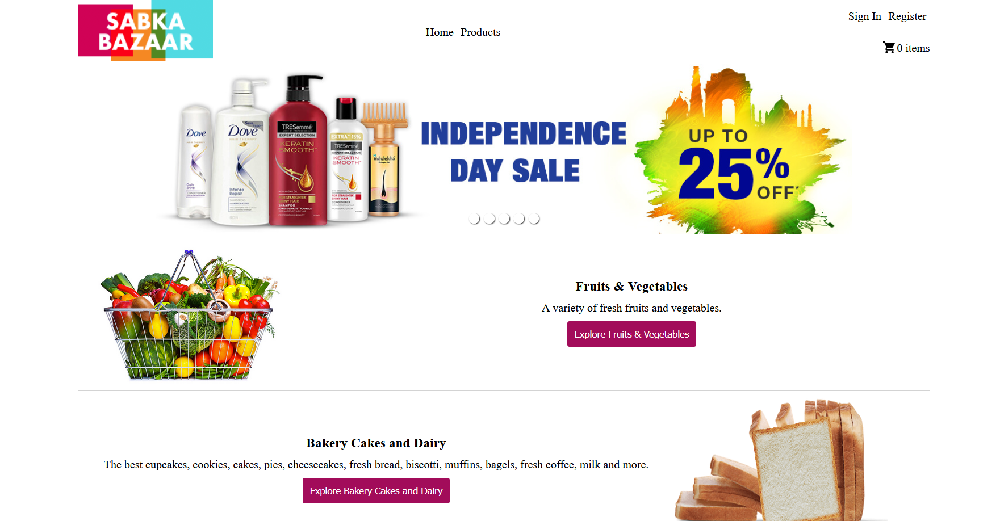
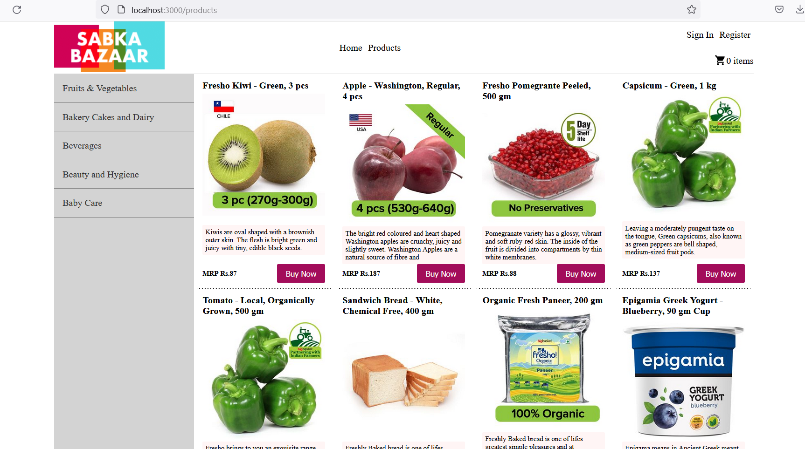
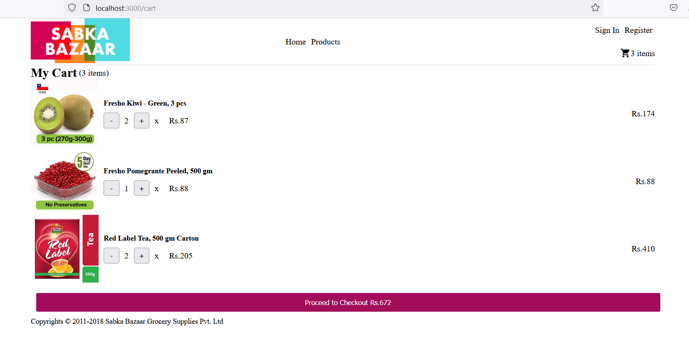
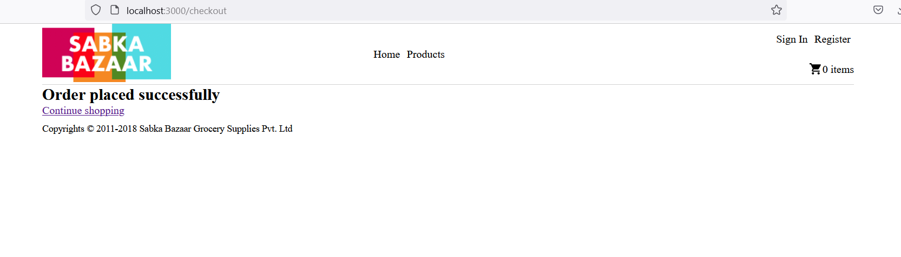

# E-commerce project

### Features

- Responsive UI
- Log in & Register
- Categories Listing
- Products Listing
- Filtering of products by categories
- Cart

### Local set up

- Clone the repo
- Install dependencies using `npm install`
- Run the project using `npm start`
- Open `http://localhost:3000`

### Project Details

- Developed by **Adil Grover**

### UI pages & screenshots

- Sign up page - http://localhost:3000/register
  

- Sign in page - http://localhost:3000/login (Credentials: adil@gmail.com, 12345)
  

- Offers page - http://localhost:3000/
  

- Products page - http://localhost:3000/products
  

- Cart page - http://localhost:3000/cart
  

- Checkout page - http://localhost:3000/checkout
  
